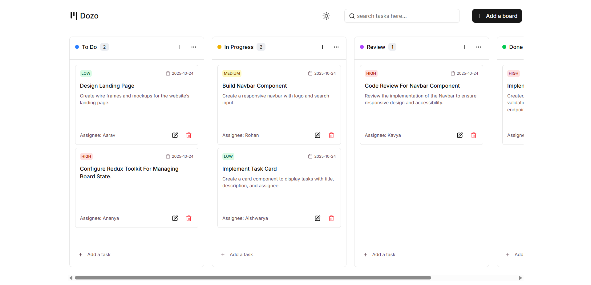
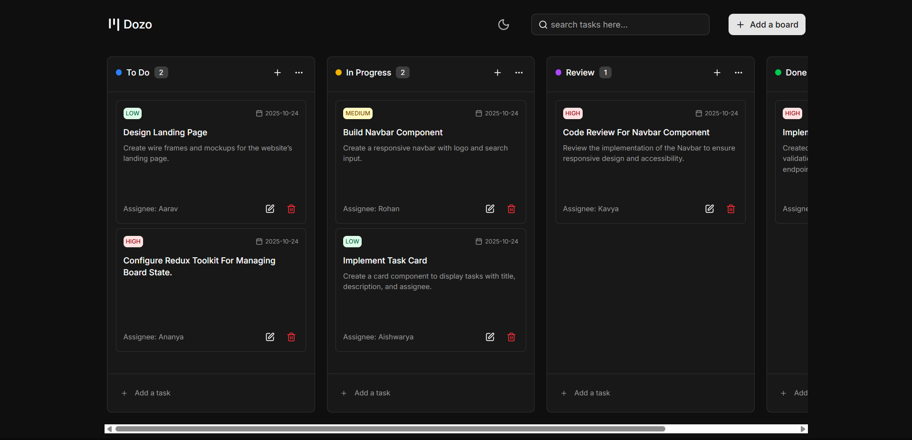

<div align="center">
  
  
  # Dozo - Kanban Task Management System
  
  <p align="center">
    A modern, intuitive Kanban board application built with React and Redux Toolkit
    <br />
    <a href="https://dozo-dxs.vercel.app/"><strong>View Demo »</strong></a>
  </p>

</div>


## 🎯 About The Project


**Dozo** is a feature-rich Kanban board application that brings visual task management to life. With its intuitive drag-and-drop interface and modern design, managing projects has never been easier.


### Quick Preview

<table>
  <tr>
    <td></td>
    <td></td>
  </tr>
  <tr>
    <td align="center"><b>Light Mode</b></td>
    <td align="center"><b>Dark Mode</b></td>
  </tr>
</table>

---

## ✨ Features

### 🎯 Core Functionality

- **Drag & Drop Interface**
  - Smooth task movement between columns
  - Visual feedback during dragging
  - Collision detection for precise placement

- **Board Management**
  - Create unlimited custom boards
  - Personalized color coding for each board
  - Edit and delete boards with ease
  - Default boards: To Do, In Progress, Review, Done

- **Task Operations**
  - ✅ Create tasks with detailed information
  - ✏️ Edit existing tasks
  - 🗑️ Delete tasks
  - 📋 Copy/move tasks between boards

### 📝 Task Details

- **Priority Levels**: High, Medium, Low (with color indicators)
- **Due Dates**: Calendar integration for deadline tracking
- **Assignees**: Track who's responsible for each task
- **Descriptions**: Rich text descriptions for detailed context

### 🎨 User Experience

- **🌓 Dark/Light Mode** - Toggle between themes
- **🔍 Search Functionality** - Find tasks quickly
- **📱 Responsive Design** - Mobile, tablet, and desktop optimized
- **💾 Auto-Save** - Changes persist automatically to local storage
- **🎭 Smooth Animations** - Delightful micro-interactions

---

## 🛠️ Tech Stack

### Core Technologies

| Category | Technologies |
|-----------|---------------|
| **Frontend** | React 19, JavaScript (ES6+) |
| **UI/Styling** | Tailwind CSS 4, shadcn/ui, Radix UI, Lucide React Icons, React Color |
| **State Management** | Redux Toolkit, React-Redux |
| **Drag & Drop** | @dnd-kit/core |
| **Build Tools** | Vite 7, ESLint |
| **Additional Libraries** | date-fns, sonner (toast notifications), react-day-picker |

---

## 🚀 Getting Started

### Prerequisites

Before you begin, ensure you have the following installed:

- **Node.js** (v20.19.0 or higher)
- **npm** (v8.0.0 or higher) or **yarn**

### Installation

1. **Clone the repository**
```bash
   git clone https://github.com/devxsagar/Dozo.git
   cd dozo
```

2. **Install dependencies**
```bash
   npm install
   # or
   yarn install
```

### Running the App

#### Development Mode
```bash
npm run dev
# or
yarn dev
```

The app will be available at `http://localhost:5173`

#### Production Build
```bash
npm run build
# or
yarn build
```

#### Preview Production Build
```bash
npm run preview
# or
yarn preview
```

#### Linting
```bash
npm run lint
# or
yarn lint
```

---

## 📁 Project Structure
```
dozo/
├── public/
│   └── kanban.svg              # App icon
├── src/
│   ├── components/
│   │   ├── ui/                 # Reusable UI components
│   │   │   ├── button.jsx
│   │   │   ├── input.jsx
│   │   │   ├── select.jsx
│   │   │   ├── calendar.jsx
│   │   │   ├── textarea.jsx
│   │   │   └── ...
│   │   ├── AddNewBoard.jsx     # Board creation modal
│   │   ├── AddNewTask.jsx      # Task creation modal
│   │   ├── Board.jsx           # Main board container
│   │   ├── BoardOptionsMenu.jsx
│   │   ├── Column.jsx          # Kanban column component
│   │   ├── ColorPicker.jsx     # Custom color picker
│   │   ├── DatePicker.jsx      # Date selection component
│   │   ├── Navbar.jsx          # Top navigation bar
│   │   └── TaskCard.jsx        # Individual task card
│   ├── store/
│   │   ├── board-slice.js      # Board & task state logic
│   │   ├── ui-slice.js         # UI state management
│   │   └── store.js            # Redux store configuration
│   ├── lib/
│   │   └── utils.js            # Utility functions
│   ├── App.jsx                 # Root component
│   ├── main.jsx                # Entry point
│   └── index.css               # Global styles
├── .gitignore
├── eslint.config.js
├── package.json
├── vite.config.js
└── README.md
```

## 📧 Contact

**Twitter** - [@devxsagar](https://x.com/devxsagar)

**Linkedin** - [@sagar-mitra19](https://www.linkedin.com/in/sagar-mitra19/)

**Portfolio:** [yourportfolio.com](https://yourportfolio.com)

---

<div align="center">
  
  ### ⭐ Don't forget to star this repo if you find it helpful!
  
  Made with ❤️ by Sagar Mitra
  
  [Report Bug](https://github.com/yourusername/dozo/issues) · [Request Feature](https://github.com/yourusername/dozo/issues)

</div>